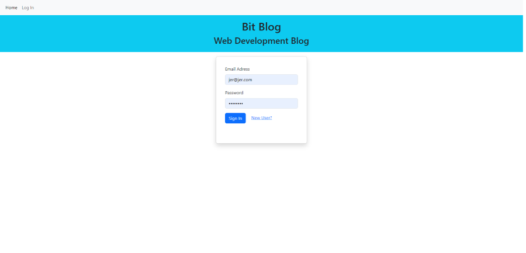
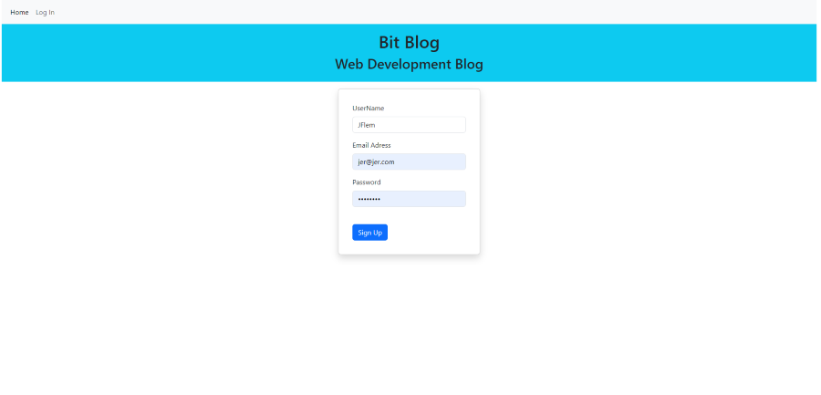
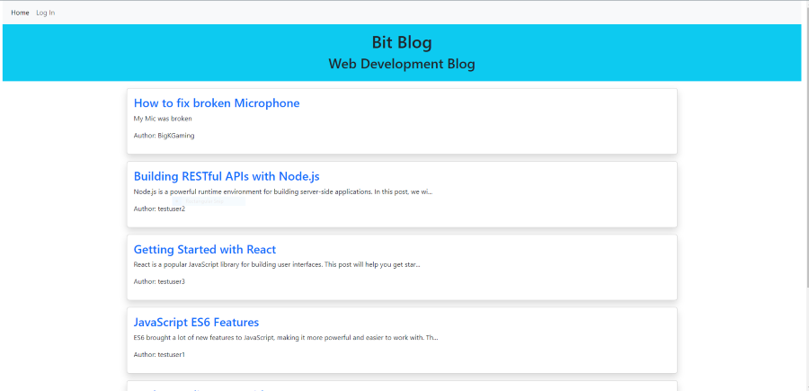
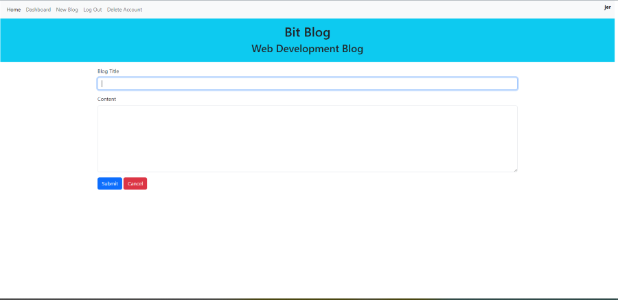
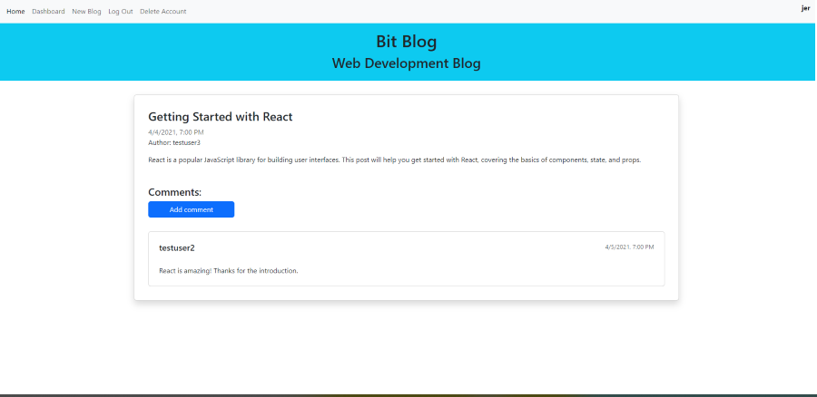
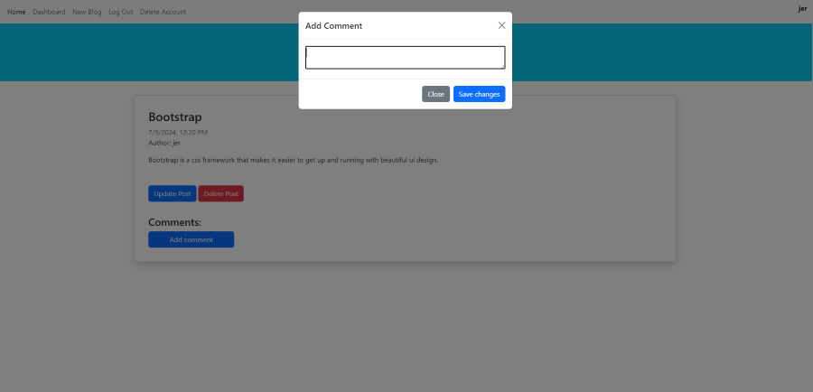

# Bit Blog Web Dev
  A blog site for web developers 

  
  ## Description
  This website provides a place to read the latest in web developement news, as well as share your own stories.
  ## Table of Contents

  1. [Installation](#Installation)
  2. [Usage](#Usage)
  3. [License](#License)
  4. [Questions](#Questions)
  
  ## Usage
  Visit [Bit-BLog-Web-Dev](https://bit-blog-web-dev.onrender.com) to read all about a variety of web developement topices. 

  At the homescreen, you will see a list of blogs. To read them you must be signed in. Click the `Login` button in the top menu, then you can either log in or sign up 
  for a new account. Please note that when signing up for a new account, your username and email address must not already be in use by another account. Also, your password must be between 8 and 20 characters long.

  If not logged in, click the login button in the navbar to go to the login screen.

  Login: 
  

  New User Sign up: 
  

  Once logged in, from the navbar you will have the following options:
  - Home
  - Dashboard
  - New Blog
  - Log Out
  - Delete Account

  ### Home
  This takes you to the homescreen where you will see a list of blogs. Click on the blog title to open the page to see the entire article.

   

  ### Dashboard
  Here, you can see a list of all of the blogs that you have created.

  ### New Blog
  This takes you to a form page where you can past a new blog. Enter a title, and add some content.

  

  ### Log Out
  This logs the user out of the current session.

  ### Delete Account
  After clicking on this button, you will be asked to confirm if you want to delete your account. Once deleted you will not be able to recover your account or your blogs.

  ---
  ### Blog page
  At the blog page, you can add comments to yours and other users' blogs. You can update or delete your comments, as well. If this is your blog, you can update or delete it.
   

   

  ***

  ## License
  This software uses the MIT License.
  ## Questions
  To see more projects or to contribute, please visit my GitHub profile at: [Flem-House-Dev](https://github.com/Flem-House-Dev).
